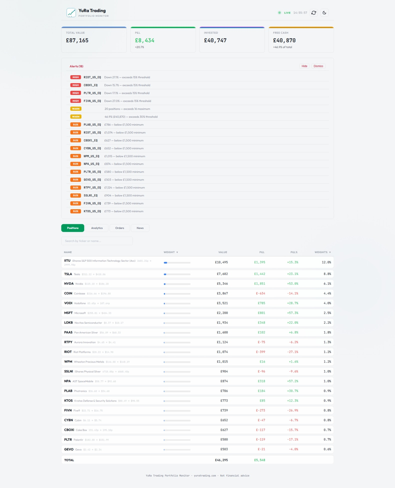
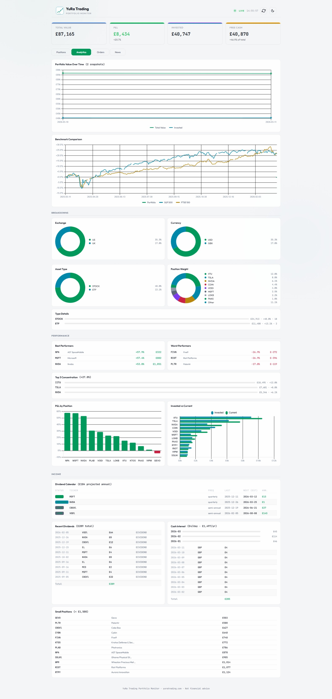
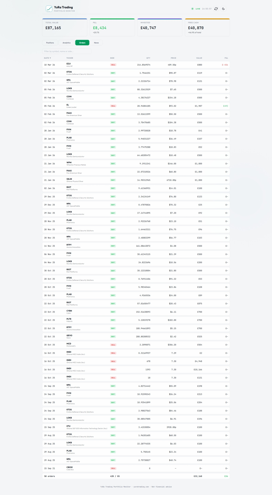
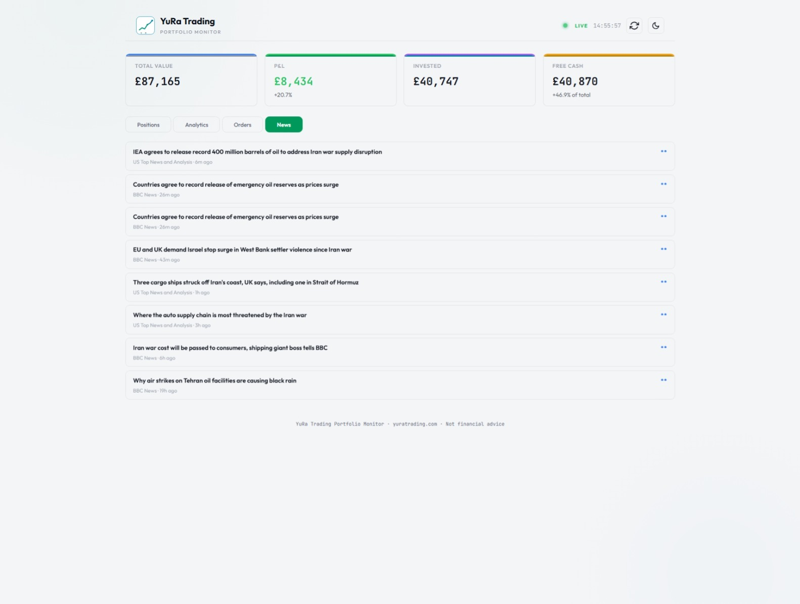

<p align="center">
  <picture>
    <source media="(prefers-color-scheme: dark)" srcset="Trading212Dashboard/ClientApp/public/logo-dark-primary.svg" />
    <source media="(prefers-color-scheme: light)" srcset="Trading212Dashboard/ClientApp/public/logo-light-primary.svg" />
    
  </picture>
</p>

<h1 align="center">Trading 212 MCP + Portfolio Dashboard</h1>

<p align="center">
  An MCP server and web dashboard for Trading 212.<br/>
  Talk to your portfolio through Claude, or view it in a real-time web UI.
</p>

<p align="center">
  <a href="#setup">Setup</a> · <a href="#claude-desktop-configuration">Claude Desktop</a> · <a href="#api-endpoints-dashboard">API</a> · <a href="LICENSE">MIT License</a>
</p>

---

## Screenshots

### Positions & Alerts
<p align="center">
  
</p>

### Analytics
<p align="center">
  
</p>

### Orders
<p align="center">
  
</p>

### News
<p align="center">
  
</p>

---

## What's Inside

### Trading212McpServer

A stdio-based MCP server that exposes your Trading 212 portfolio as tools for Claude Desktop (or any MCP client).

**Available tools:**

| Tool | Description |
|---|---|
| `get_portfolio_summary` | Full portfolio view with all positions, values, and P&L |
| `get_position` | Detailed view of a single position (orders, dividends, P&L) |
| `get_cash_balance` | Account cash breakdown |
| `get_portfolio_analysis` | Winners/losers, concentration metrics, position sizing |
| `get_dividend_history` | Recent dividend payments |
| `search_instrument` | Find T212 ticker symbols by name (e.g. "Tesla" → `TSLA_US_EQ`) |

### Trading212Dashboard

An ASP.NET Core backend + Angular 19 SPA that gives you a real-time portfolio dashboard.

**Features:**
- Live portfolio positions with P&L, weight%, and sorting
- Position detail view with order history and dividends
- Analytics page with charts (performance, benchmark comparison, breakdowns)
- Doughnut charts for currency, exchange, asset type, and weight distribution
- Benchmark comparison against S&P 500 and FTSE 100 (via Yahoo Finance)
- Dividend calendar and income tracking
- News feed with configurable keyword filtering
- Risk alerts (drawdown, concentration, position size)
- Dark/light theme toggle
- URL-based navigation (browser back/forward works)

## Prerequisites

- [.NET 10 SDK](https://dotnet.microsoft.com/download/dotnet/10.0)
- [Node.js 20+](https://nodejs.org/) (for Angular frontend)
- A Trading 212 account with API access enabled
- API key and secret from Trading 212 (Settings → API)

## Setup

### 1. Clone the repository

```bash
git clone https://github.com/YuRa-Trading/portfolio-monitor.git
cd "portfolio-monitor"
```

### 2. Set environment variables

Copy the example env file and fill in your credentials:

```bash
cp .env.example .env
```

Then set the variables in your shell:

**Linux / macOS:**
```bash
export T212_API_KEY="your-api-key"
export T212_API_SECRET="your-api-secret"
export T212_ENVIRONMENT="live"   # or "demo"
```

**Windows (PowerShell):**
```powershell
$env:T212_API_KEY = "your-api-key"
$env:T212_API_SECRET = "your-api-secret"
$env:T212_ENVIRONMENT = "live"   # or "demo"
```

Alternatively, create a `Properties/launchSettings.json` in each project (these are git-ignored):

```json
{
  "profiles": {
    "default": {
      "commandName": "Project",
      "environmentVariables": {
        "T212_API_KEY": "your-api-key",
        "T212_API_SECRET": "your-api-secret",
        "T212_ENVIRONMENT": "live"
      }
    }
  }
}
```

### 3. Run the Dashboard

```bash
# Install Angular dependencies
cd Trading212Dashboard/ClientApp
npm install

# Build the Angular frontend
npx ng build

# Run the server
cd ../..
dotnet run --project Trading212Dashboard
```

The dashboard will be available at **http://localhost:5050**.

### 4. Run the MCP Server (for Claude Desktop)

```bash
dotnet run --project Trading212McpServer
```

The MCP server communicates via stdio — it won't produce visible output. It's designed to be launched by Claude Desktop.

## Claude Desktop Configuration

Add to your Claude Desktop config:

- **Windows:** `%APPDATA%\Claude\claude_desktop_config.json`
- **macOS:** `~/Library/Application Support/Claude/claude_desktop_config.json`

```json
{
  "mcpServers": {
    "trading212": {
      "command": "dotnet",
      "args": ["run", "--project", "/path/to/Trading212McpServer"],
      "env": {
        "T212_API_KEY": "your-key",
        "T212_API_SECRET": "your-secret",
        "T212_ENVIRONMENT": "live"
      }
    }
  }
}
```

## Project Structure

```
portfolio-monitor/
├── Trading212McpServer/          # MCP server (console app)
│   ├── Program.cs                # Entry point (stdio MCP protocol)
│   ├── Trading212Client.cs       # HTTP client for T212 API
│   ├── Trading212Tools.cs        # MCP tool definitions
│   ├── NewsAndAlertTools.cs      # News + alert tools
│   ├── Config/AlertConfig.cs     # Alert threshold configuration
│   └── Models/Trading212Models.cs # API response models
│
├── Trading212Dashboard/          # Web dashboard (ASP.NET + Angular)
│   ├── Program.cs                # REST API endpoints + SPA hosting
│   └── ClientApp/                # Angular 19 frontend
│       └── src/app/
│           ├── components/       # UI components
│           └── shared/           # Models, services, pipes, chart components
│
├── .env.example                  # Environment variable template
└── Trading 212 MCP.sln           # Visual Studio solution
```

Both projects share C# models via MSBuild `<Compile Include>` links — the source of truth lives in `Trading212McpServer/`.

## Trading 212 Ticker Format

Trading 212 uses the format `SYMBOL_EXCHANGE_EQ`:

| Stock | Ticker |
|---|---|
| Apple | `AAPL_US_EQ` |
| Tesla | `TSLA_US_EQ` |
| Vodafone | `VOD_L_EQ` |
| HSBC | `HSBA_L_EQ` |

Use the `search_instrument` MCP tool or the `/api/instruments` endpoint to look up tickers.

## API Endpoints (Dashboard)

| Endpoint | Description |
|---|---|
| `GET /api/portfolio` | Portfolio summary with positions |
| `GET /api/position/{ticker}` | Single position detail |
| `GET /api/alerts` | Risk alerts |
| `GET /api/analytics` | Performance analytics |
| `GET /api/news?limit=N` | Filtered news feed |
| `GET /api/dividends?limit=N` | Dividend history |
| `GET /api/orders?limit=N` | Order history |
| `GET /api/interest?limit=N` | Interest payments |
| `GET /api/snapshots` | Historical portfolio snapshots |
| `GET /api/dividend-calendar` | Upcoming dividends |
| `GET /api/benchmark` | Performance vs S&P 500 / FTSE 100 |

## Trading 212 API Reference

This project wraps the [Trading 212 Public API](https://docs.trading212.com/api). Authentication uses Basic auth with your API key and secret.

| Endpoint | Description |
|---|---|
| `GET /equity/account/cash` | Account cash balance |
| `GET /equity/account/info` | Account metadata |
| `GET /equity/positions` | All open positions |
| `GET /equity/positions/{ticker}` | Single position |
| `GET /equity/orders` | Active orders |
| `GET /equity/history/dividends` | Dividend history |
| `GET /equity/history/orders` | Order history |
| `GET /equity/metadata/instruments` | All available instruments |

## Alert Configuration

Alerts are configured in `appsettings.json` under the `"Alerts"` section. Default thresholds:

- **Drawdown alert** — position drops more than 20%
- **Concentration alert** — single position exceeds 30% of portfolio
- **Position size alert** — position is under £500
- **Position count alert** — more than 30 positions

To personalise without modifying the committed defaults, create an `appsettings.Development.json` in either project (this file is git-ignored):

```json
{
  "Alerts": {
    "Portfolio": {
      "MaxDrawdownPercent": 15,
      "MaxConcentrationPercent": 25,
      "MinPositionSize": 1500,
      "MaxPositions": 16
    },
    "NewsKeywords": [
      "Iran", "OPEC", "oil price", "gold price",
      "Rolls-Royce", "BP", "defence spending"
    ]
  }
}
```

Only include the sections you want to override — the rest falls back to `appsettings.json` defaults.

## Tech Stack

- **Backend:** .NET 10, ASP.NET Core Minimal APIs
- **Frontend:** Angular 19 (standalone components, signals), Chart.js 4.x
- **MCP:** ModelContextProtocol SDK 1.1.0
- **Data:** Trading 212 API, Yahoo Finance (benchmarks), BBC/Reuters/CNBC RSS (news)

## License

[MIT](LICENSE)
